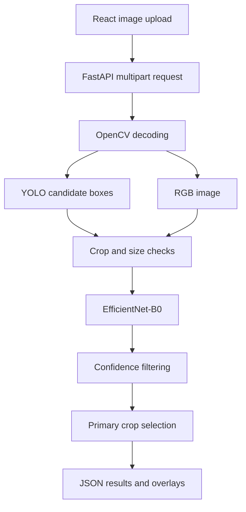
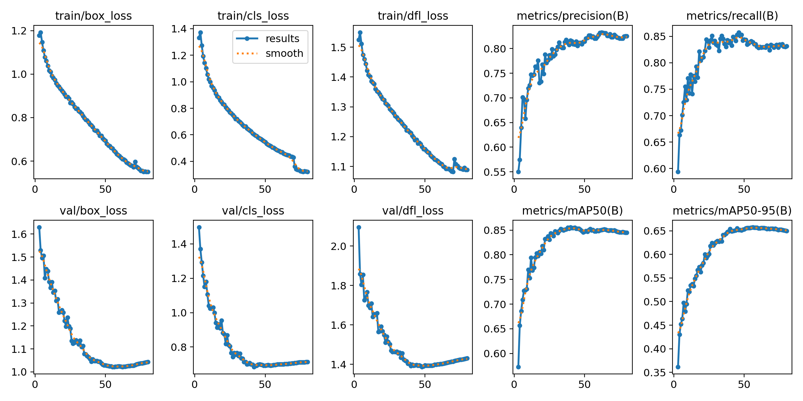
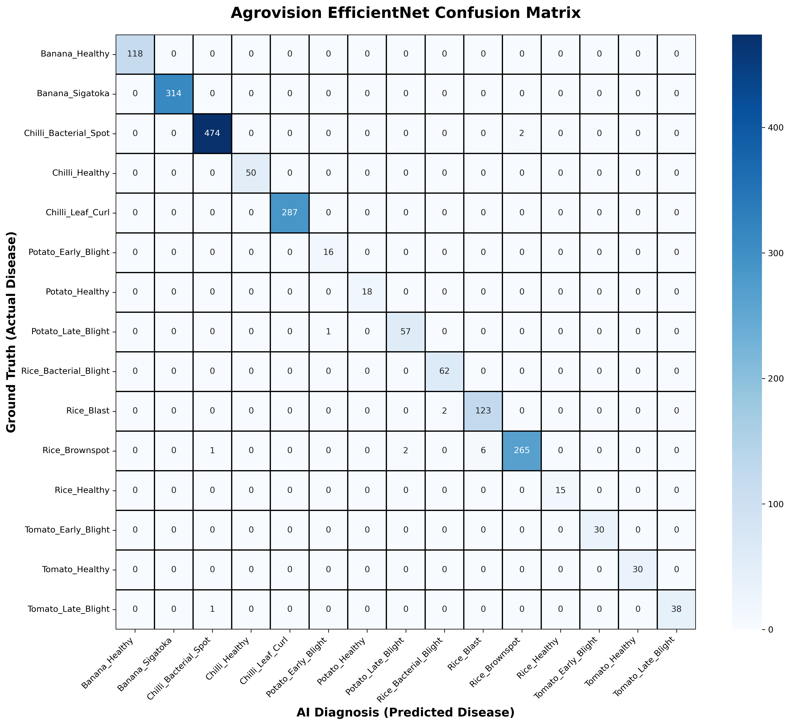

# AgroVision — Multi-Crop Disease Prediction

**Two-stage computer vision · YOLO localization · EfficientNet classification**

A crop-image analysis project combining leaf-region detection with a specialist classifier, exposed through a FastAPI endpoint and a React interface.

[Getting started](#getting-started) · [Model pipeline](#model-pipeline) · [Repository guide](#repository-guide) · [Training](#training-workflow) · [Results](#recorded-results) · [API](#api-reference)

## Model pipeline

1. The frontend sends an image to `POST /predict`.
2. YOLO locates candidate regions.
3. Each qualifying region is cropped and resized to 224 × 224 pixels.
4. EfficientNet-B0 classifies the crop into one of 15 labels.
5. The API returns confidence scores and normalized bounding boxes, retaining up to five detections for the primary crop type.

The implementation uses YOLO with `conf=0.25`, rejects crops smaller than 10 pixels in either dimension, and retains classifier outputs at or above 0.40 confidence.

## Supported labels

| Crop | Classes |
| --- | --- |
| Banana | Healthy, Sigatoka |
| Chilli | Healthy, Bacterial Spot, Leaf Curl |
| Potato | Healthy, Early Blight, Late Blight |
| Rice | Healthy, Bacterial Blight, Blast, Brownspot |
| Tomato | Healthy, Early Blight, Late Blight |

## Repository guide

| Path | Purpose |
| --- | --- |
| `Agrovision_Pro/` | React interface wired to the local prediction API |
| `agrovision-app/` | Earlier frontend; its API helper returns a mock prediction |
| `detection_code2/api.py` | Two-stage inference API |
| `detection_code2/generate_crops.py` | Classification crop preparation |
| `detection_code2/train_efficientnet.py` | EfficientNet training |
| `detection_code2/train_ver2.py` | Detector training |
| `detection_code/` | Earlier detection experiments and dataset |
| `project_master_log.md` | Development history and reported experiments |

Start with **Agrovision_Pro** to explore the interface connected to the two-stage API.

## Getting started

This repository contains datasets and multiple model checkpoints, so cloning can be large.

```bash
git clone --depth 1 https://github.com/Praveenraj1618/Multi_Crop_Disease_Prediction.git
cd Multi_Crop_Disease_Prediction
python -m venv .venv
```

Activate with `.venv\Scripts\Activate.ps1` in Windows PowerShell or `source .venv/bin/activate` on macOS/Linux.

### Backend prerequisites

```bash
python -m pip install fastapi uvicorn python-multipart ultralytics torch torchvision opencv-python numpy pillow
```

Before starting, edit the model paths in `detection_code2/api.py`:

| Variable | Required artifact |
| --- | --- |
| `MODEL_PATH` | A compatible trained YOLO checkpoint; the repository contains `detection_code2/runs/train/multi_crop_v2/weights/best.pt` |
| `EFFICIENTNET_PATH` | The trained 15-class `efficientnet_best.pth` classifier |

Both variables currently contain machine-specific absolute Windows paths. The EfficientNet checkpoint is **not present in the repository tree** and must be supplied or produced using the training workflow. The API loads both models at startup.

After the artifacts and paths are ready:

```bash
python detection_code2/api.py
```

API docs: http://localhost:8000/docs

### Frontend

In another terminal, from the repository root:

```bash
cd Agrovision_Pro
npm install
npm run dev
```

Open the address printed by Vite. The processing screen calls `http://localhost:8000/predict`; update that URL in `src/app/screens/Processing.tsx` if your backend runs elsewhere.

## Interface capabilities

The connected frontend includes upload, processing, results, and history screens. Prediction results support multiple bounding boxes. Scan history is saved in the browser's local storage.

The UI's processing-step animation is a presentation aid, not backend progress reporting. Its severity label is derived from bounding-box area rather than a separately validated severity model.

## Evaluation

Training artifacts, plots, and experiment notes are committed under the detection folders and in [the project log](project_master_log.md). Reported classifier results should be distinguished from the accuracy of the complete detector-plus-classifier pipeline; this documentation refresh does not reproduce training or independently verify those metrics.

## Architecture in detail



YOLO answers **where a candidate region is**. EfficientNet answers **which crop/condition label matches that region**. This separates localization from fine-grained classification.

The API discards YOLO's class prediction after obtaining its boxes. EfficientNet's label and softmax score become the reported result. A region missed by YOLO never reaches the classifier.

### Exact inference behavior

| Stage | Implementation |
| --- | --- |
| Decode | OpenCV reads image bytes as BGR |
| Detect | YOLO uses confidence threshold 0.25 |
| Additional check | The later detector threshold of 0.20 is redundant after the 0.25 filter |
| Crop | Clip boxes to image bounds; skip regions below 10 pixels in width or height |
| Preprocess | Convert to RGB, resize to 224 × 224, convert to tensor, apply ImageNet normalization |
| Classify | EfficientNet-B0 predicts among 15 labels without gradient tracking |
| Filter | Retain classifier confidence at or above 0.40 |
| Rank | Sort by classifier confidence |
| Select | Retain up to five detections matching the highest-ranked result's crop family |

The crop-family filter uses a string prefix. It suppresses other crop families in mixed-crop photographs. Reported confidence is a classifier percentage, not a combined or calibrated probability for the whole pipeline.

## Training workflow

### 1. Prepare detector data

[train_ver2.py](detection_code2/train_ver2.py) expects `multi-crop-disease-detection1.v2i.yolov8/data.yaml` beside the script. That v2 dataset path is absent from the inspected repository tree. Supply it or update the configuration; do not silently treat the committed v1 data as the same evaluation dataset.

Keep class-ID order consistent across annotations, crop generation, and the API. YOLO labels contain a zero-based class ID followed by normalized box center and size.

### 2. Train YOLOv8m

After configuring the dataset, run from `detection_code2/`:

```bash
python train_ver2.py
```

| Setting | Committed value |
| --- | --- |
| Initial checkpoint | `yolov8m.pt` |
| Epochs / input size / batch | 80 / 640 / 12 |
| Device | CUDA when available, otherwise CPU |
| Precision | Automatic mixed precision enabled |
| Optimizer | `auto` |
| Learning-rate settings | `lr0=0.01`, cosine schedule |
| Weight decay | 0.0005 |
| Augmentation | HSV variation, rotation, translation, scaling, horizontal flipping |
| Early-stopping patience | 25 |
| Loading | Cache enabled, four workers |
| Checkpoint interval | Every 10 epochs |

The script invokes validation and ONNX export after training. The API still loads PyTorch weights; exporting does not change the serving runtime. Archived run arguments show resumed training, so the starting script and saved execution configuration are not identical.

### 3. Generate classifier crops

Edit `BASE_IN` and `BASE_OUT` in [generate_crops.py](detection_code2/generate_crops.py), then run:

```bash
python generate_crops.py
```

The generator reads ground-truth boxes, converts normalized coordinates to pixels, clips them to image bounds, and saves crops into class folders under the original train/valid/test splits.

Output filenames are randomly generated. Re-running into the same destination adds duplicate content under new names; use a fresh destination. Split related source images correctly before cropping to avoid leakage.

The [project log](project_master_log.md) reports **45,228 crops**: 40,959 training, 2,357 validation, and 1,912 test samples. These are historical reported counts, not a fresh count of a supplied v2 dataset.

### 4. Fine-tune EfficientNet-B0

Update `DATA_DIR` in [train_efficientnet.py](detection_code2/train_efficientnet.py), then run from `detection_code2/`:

```bash
python train_efficientnet.py
```

| Setting | Implementation |
| --- | --- |
| Initialization | ImageNet-pretrained EfficientNet-B0 |
| Output layer | Linear layer with 15 outputs |
| Optimization scope | All model parameters |
| Loss | Cross-entropy |
| Optimizer | AdamW; learning rate 0.001; weight decay 0.0001 |
| Schedule | CosineAnnealingLR over 10 epochs |
| Batch / epochs | 32 / 10 |
| Training transforms | Resize to 256, random 224 crop, flip, rotation, brightness/contrast jitter |
| Validation transforms | Resize to 224, tensor conversion, ImageNet normalization |
| Checkpoint selection | Improvement in validation accuracy |
| Output | `efficientnet_best.pth` in the current working directory |

This is transfer learning with fine-tuning. Compare `ImageFolder.classes` with the API's hardcoded label order before loading the checkpoint for inference.

### 5. Evaluate the classifier

Configure the dataset and checkpoint paths in [analyze_model.py](detection_code2/analyze_model.py), then run:

```bash
python -m pip install scikit-learn matplotlib seaborn
python analyze_model.py
```

The script evaluates prepared test crops, prints precision/recall/F1 by class, and saves a confusion matrix. It evaluates classification given ground-truth crops, not the complete image-to-result pipeline.

## Recorded results

The detector values below come from the committed [training CSV](detection_code2/runs/train/multi_crop_v2/results.csv), which contains 78 recorded rows spanning epochs 3–80.

| Detector validation measure | Epoch 56: highest recorded mAP@50–95 | Epoch 80: final row |
| --- | --- | --- |
| Precision | 0.82449 | 0.82520 |
| Recall | 0.83896 | 0.83131 |
| mAP@50 | 0.85019 | 0.84495 |
| mAP@50–95 | 0.65742 | 0.64997 |

These are historical validation results. Selecting a CSV row does not independently establish which weights are stored in `best.pt`.

The project log reports **99.22% classifier accuracy** and **0.9922 F1** on prepared test crops. It does not specify the averaging method for that summary F1. The classifier checkpoint is absent, so these remain reported classifier results rather than independently reproduced end-to-end scores.

### Archived evaluation visuals



*Recorded detector training curves.*



*Classifier confusion matrix committed with the project; not regenerated in this documentation update.*

For a complete evaluation, process independent full images through both models and measure missed regions, incorrect classifications, false positives, mixed-crop behavior, and latency.

## API reference

**Endpoint:** `POST /predict`  
**Request:** `multipart/form-data` with an image field named `file`.

Use http://localhost:8000/docs to submit a local test image.

| Field | Meaning |
| --- | --- |
| `success` | Whether any result survived filtering |
| `disease` | Highest-ranked crop/condition label |
| `confidence` | Classifier score multiplied by 100, rounded to two decimals |
| `area_ratio` | Box area divided by full-image area |
| `box` | Primary normalized coordinates: x1, y1, x2, y2 |
| `boxes` | Up to five detections from the selected crop family |
| `message` | Explanation in a no-detection response |

When nothing survives filtering:

```json
{
  "success": false,
  "message": "No disease or crop pattern detected in image."
}
```

No detection does not mean the plant is healthy. Healthy plants have explicit class labels and can yield successful predictions.

The handler currently lacks explicit upload-size validation and an undecodable-image check before color conversion. Malformed images may return a server error.

## Frontend interpretation

[Processing.tsx](Agrovision_Pro/src/app/screens/Processing.tsx) maps labels to the disease catalog and stores scans in browser local storage under `agrovision_scans`.

- Bounding-box area is relative to the entire photograph, not a segmented diseased proportion of the leaf.
- Display severity uses area thresholds above 0.10 and 0.35 for medium and high, with a healthy-label condition.
- History belongs to that browser and origin; this flow has no account-backed history service.
- Processing-step animations advance on frontend timers.
- Request failures and no-detection responses redirect to upload.

## Troubleshooting

| Symptom | Check |
| --- | --- |
| Backend fails during startup | Both model paths must exist; supply the EfficientNet checkpoint |
| Detector data missing | Supply the v2 dataset or correct the training path |
| Predictions have incorrect labels | Compare training class order and API label order |
| Browser returns to upload | Inspect API response, backend console, and configured URL |
| GPU memory exhausted | Reduce training batch size; two serving models also consume memory |
| Crop counts grow unexpectedly | Use a fresh generator output directory |
| Training artifacts are misplaced | Check the working directory used to launch the scripts |

## Development roadmap

Proposed improvements include portable model paths, a versioned checkpoint manifest with class order, upload validation, persistent experiment reports, and full-pipeline evaluation. Explicit mixed-crop handling, classifier calibration, and a validated severity method would improve interpretation of the results.

## Technology

Python, PyTorch, torchvision, Ultralytics YOLO, EfficientNet-B0, FastAPI, OpenCV, React, TypeScript, Vite, and Tailwind CSS.

Frontend asset acknowledgments are preserved in [ATTRIBUTIONS.md](Agrovision_Pro/ATTRIBUTIONS.md).
